>   Plataformas Web

Práctica 1: Consumo de APIs en la nube

>   Evelyn Pintado Chacho [1]

>   [1]Estudiante de la Carrera de Computación 11 de abril de 2020

>   Cuenca – Ecuador

Objetivo Alcanzado:

-   Desarrollar una aplicación web con HTML, JavaScript y Web Services.

-   Trabajar con bases de datos OMDB

-   Crear un repositorio en GitHub donde se muestre la implementación de la
    aplicación web.

Actividades Desarrolladas

1.  **Identificar gráficamente la arquitectura y el patrón de diseño de la
    aplicación a desarrollar.**

>   Para la arquitectura utilizamos Cliente-Servidor

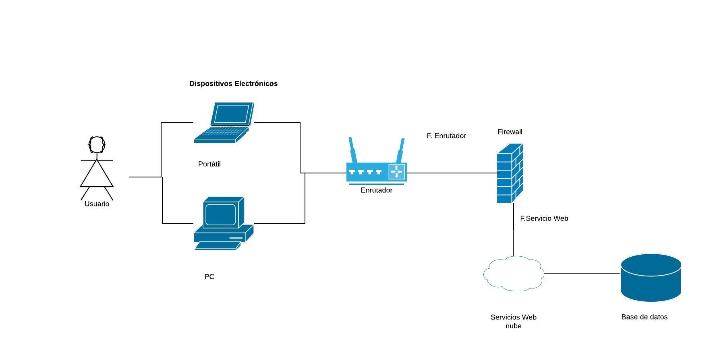

>   Imagen que contiene texto Descripción generada automáticamente

1.  **Generar una llave para consumir los servicios web de la API de OMDb.**

>   Generaremos nuestra API desde OMDb.

>   Ingresamos a la siguiente dirección <http://www.omdbapi.com/> , es un
>   servicio web RESTful donde obtendremos una base datos de películas abiertas,
>   que nos proporciona todo el contenido y las imágenes de la información
>   requerida.

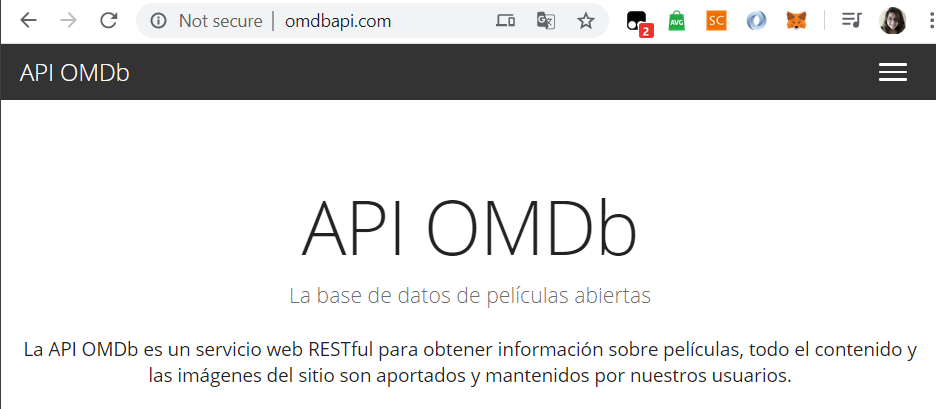

Seleccionamos la opción Clave API

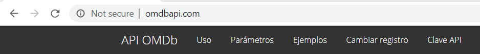

>   Lo mejor de este servicio es que podremos generar nuestra API de manera
>   gratuita, únicamente llenamos los siguientes campos, esperamos el mensaje de
>   confirmación en nuestro correo electrónico y tendremos nuestro API.

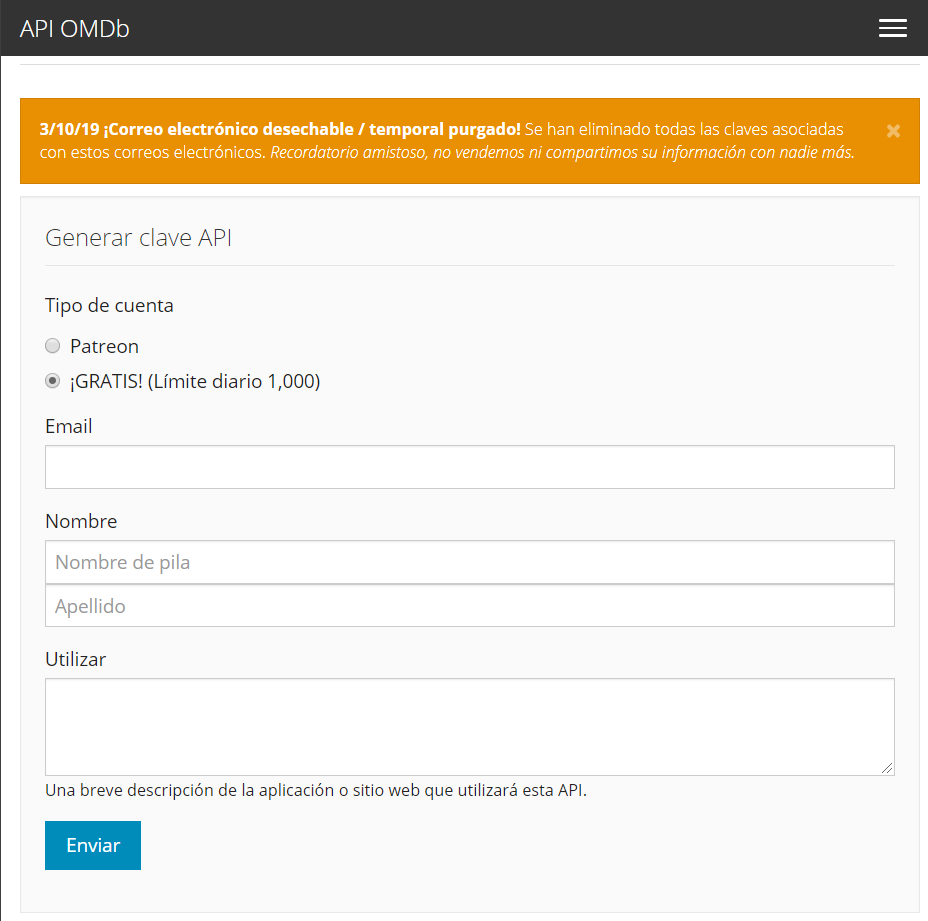

>   Activamos nuestra API antes de usarla, en el link que nos envían al correo
>   electrónico en conjunto con nuestra clave.

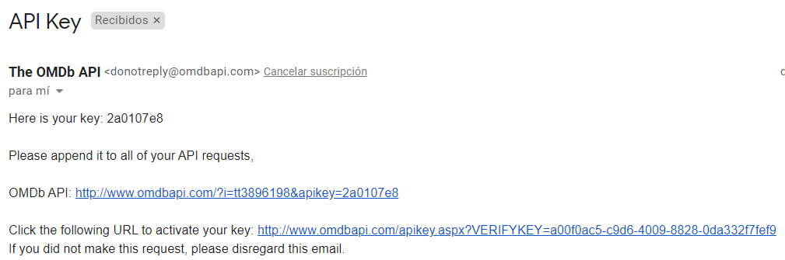

1.  **Crear un repositorio en GitHub con el nombre “Practica00 – Consumo de APIs
    en la nube”.**

>   Al tener desarrollado un repositorio con un nombre muy similar en el GitHub,
>   eh apostado por el siguiente:

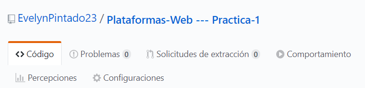

1.  **Desarrollar una aplicación con HTML + CSS + Javascript + Web Services para
    buscar películas y toda su información de la base de datos de OMDb.**

-   Aplicación desarrollada

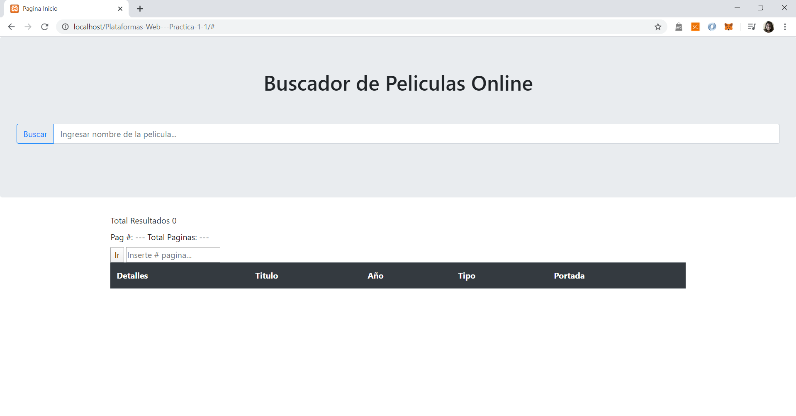

Motor de búsqueda

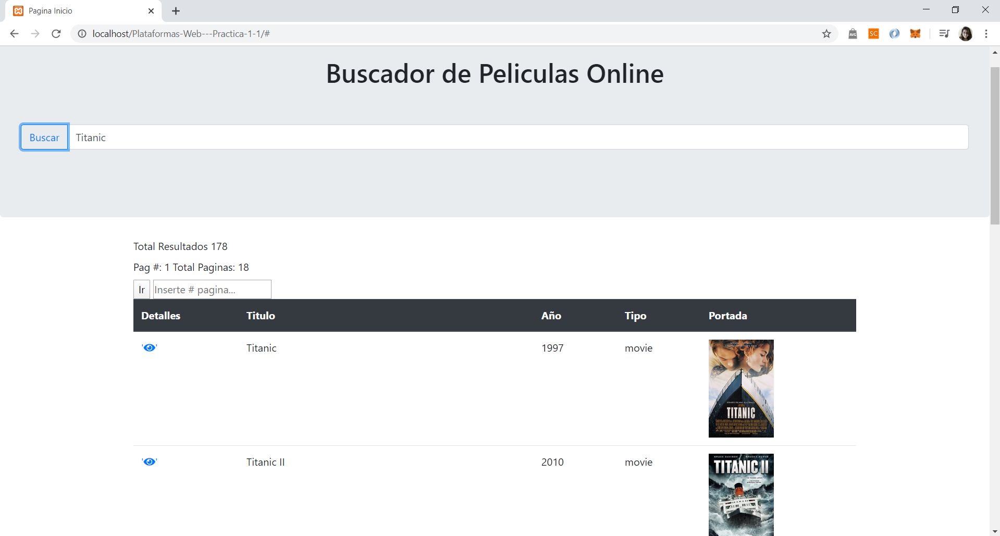

Visualización de toda la información en ventana emergente.

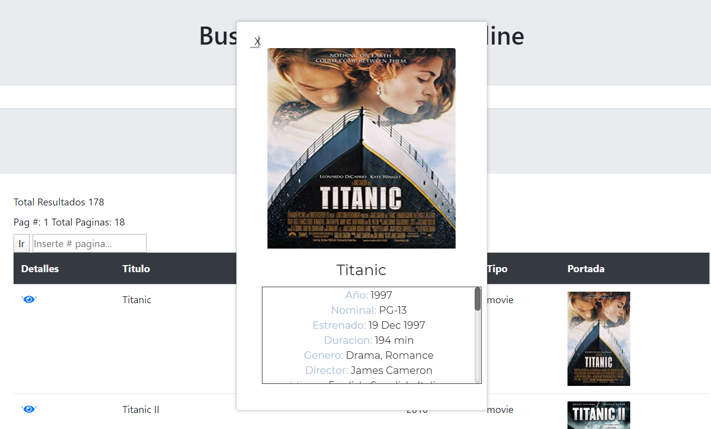

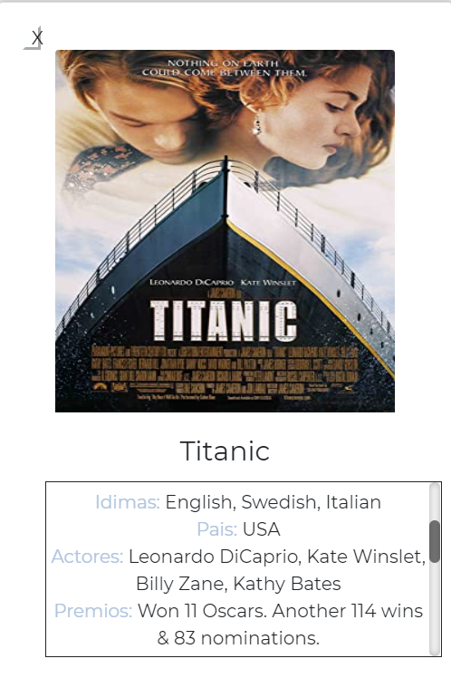

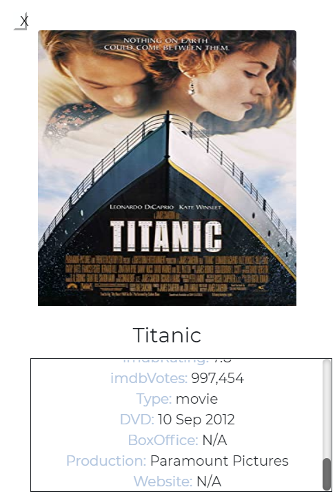

Validamos que tenga portada la película y los datos no existentes.

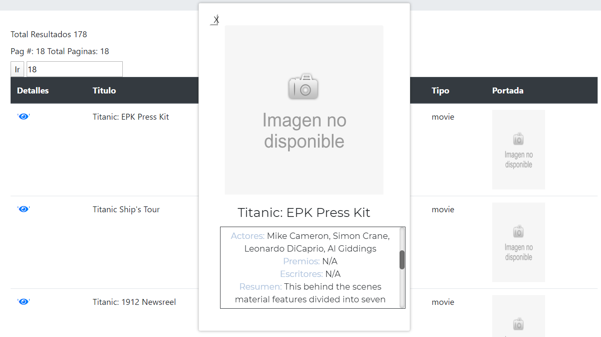

-   Métodos utilizados

>   Búsqueda de Películas en la base con la API.

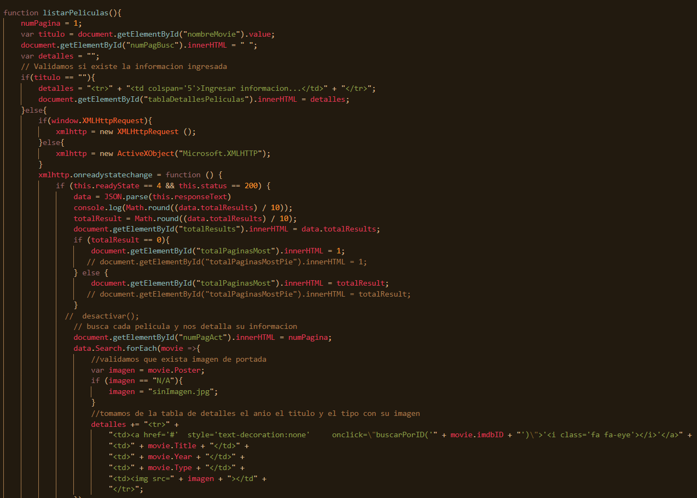

>   Pasar de página a página (paginación).

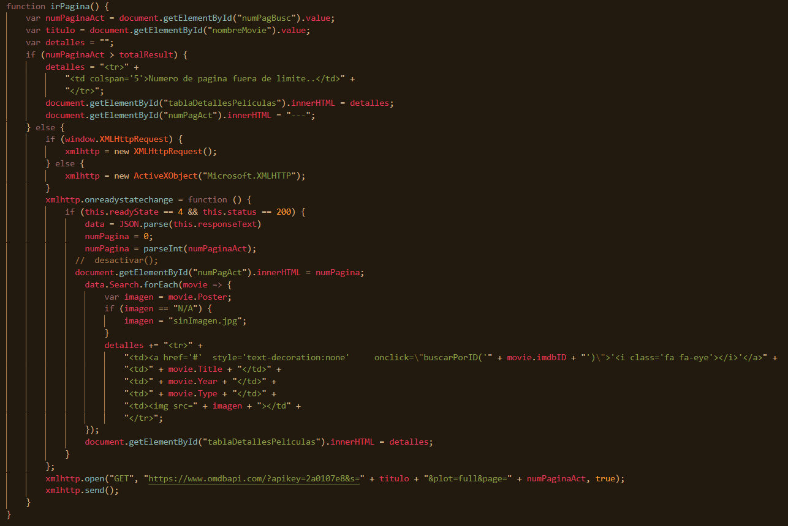

>   Búsqueda por ID.

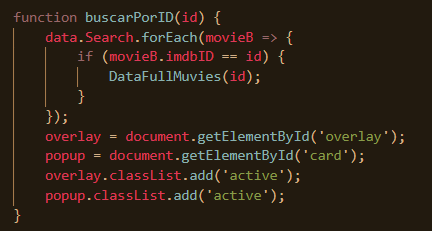

1.  **Realizar varios commits en la herramienta GitHub que demuestren el
    desarrollo de la aplicación.**

>   Número de commits

>   Commits desarrollados

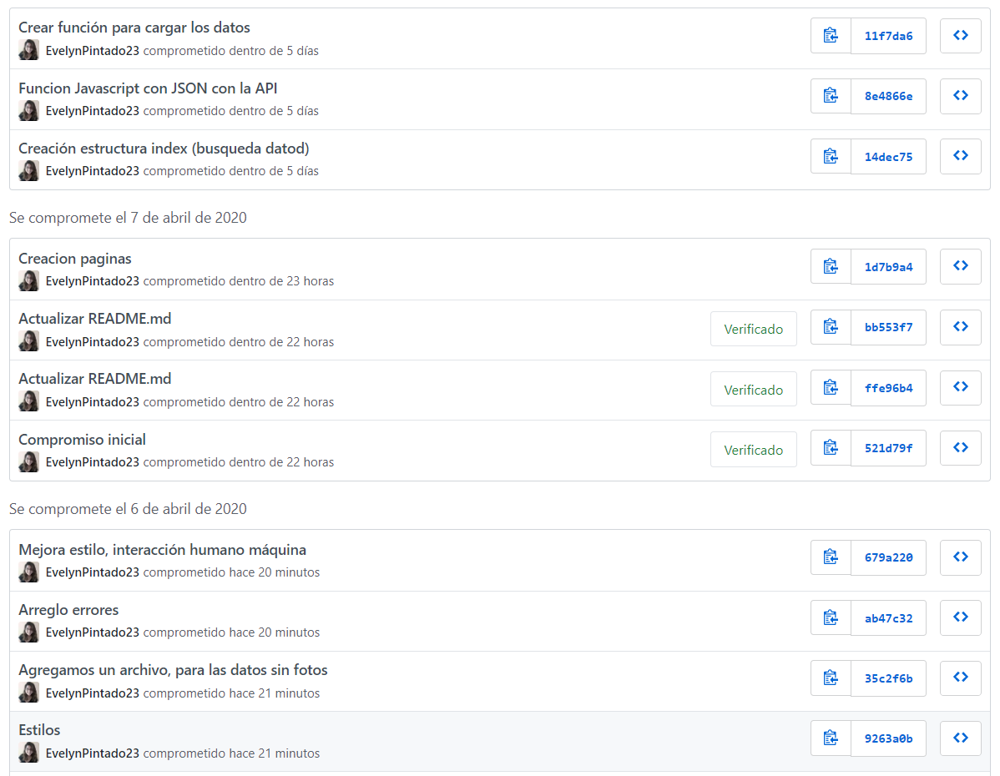

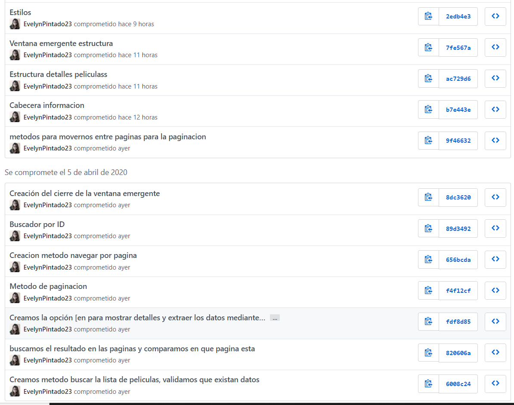

1.  **Generar el informe de la práctica con el desarrollo de cada uno de los
    puntos descritos anteriormente.**

2.  **Implementar el README del repositorio del proyecto con la misma
    información del informe de la práctica.**

3.  **Subir al AVAC el informe del proyecto en formato \*.pdf. El informe debe
    contar con conclusiones apropiadas y la firma de cada estudiante.**

4.  **Link del video en youtube: http://www.youtube.com/watch?v=UwPFjxjq_kU**

**CONCLUSIONES**:

-   Se han identificado de una forma más precisa los tipos de arquitecturas web,
    y sobre todo la que se utilizó en esta práctica. Por lo que, de manera más
    eficaz, utilizamos los servicios en la nube.

-   Se generó una API en el servicio OMDb por lo que utilizamos objectos de
    JSON.

-   Se realizó una página web, que, en forma de tabla, nos muestra
    características principales de una película y si nosotros queremos podemos
    encontrar la información detallada.

**RECOMENDACIONES**:

-   Para generar una aplicación con conceptos de interacción humano máquina,
    debemos primero tener más conocimiento del mismo y sugiero que se
    especifique en la parte de actividades por realizar de la guía de práctica.

**Nombre de estudiante: Evelyn Pintado Ch.**

**Firma de estudiante:**

